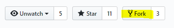
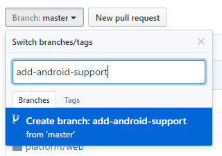
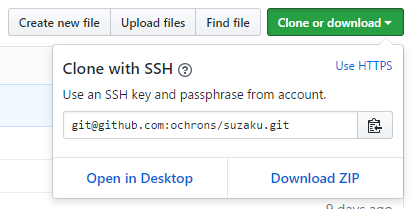
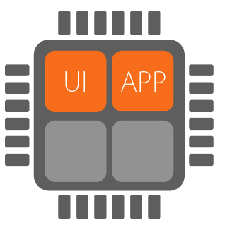
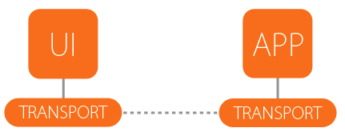
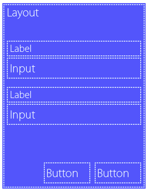
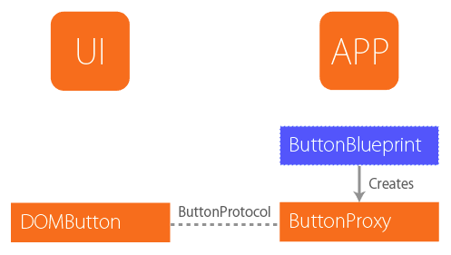
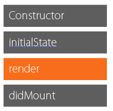
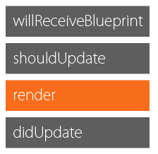
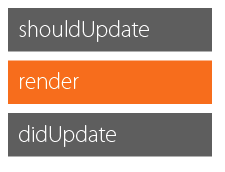

# Welcome, dear contributor

Contributors, those mythical beings who unselfishly sacrifice their time in effort to help out fellow developers, whom they
may have never met, in building high quality software and libraries. You are most welcome. This documentation is for you.

## The Why

Contributors are important. Most open source projects suffer from a low
[bus factor](https://en.wikipedia.org/wiki/Bus_factor), often having only a single maintainer, on whom the whole project then
depends. It is the responsibility of the project maintainer(s) to encourage and help potential contributors to get started
with the project. That is why this documentation exists.

Typical open source library documentation (if it exists in the first place :smirk: ) is intended for the _user_ of the
library, describing how the library is used etc. This is of course fine for the user, but it doesn't help a potential
contributor that much, as they would like to know more about the internals, architecture and design of the library. Unlike
user documentation, this _contributor documentation_ focuses on exactly that, making it easier to get started with your
contributions, whether they are just fixing typos in the documentation, reporting issues, correcting them, writing tests or
improving the overall design. All contributions from all contributors are welcome!

## The Guide

This guide is divided into following sections to help you get around quickly.

-   [Getting started](#getting-started) - taking those first baby steps
-   [Background and motivation](#background-and-motivation) - tells you why Suzaku was created
-   [Design and Architecture](#design-and-architecture) - the core principles and ideas behind Suzaku
-   [Workflow](#workflow) - the actual workflow for contributing
-   [Style guide](#style-guide) - keeping up with the latest style
-   [Practical tips](#practical-tips) - making your life easier with some practical tips

## Getting started

First of all make sure you have the necessary tools installed. You'll need the following:

-   Git ([downloads](https://git-scm.com/downloads) for all platforms)
-   Java 8 JDK ([downloads](http://www.oracle.com/technetwork/java/javase/downloads/jdk8-downloads-2133151.html) for all
    platforms)
-   SBT (setup for [Linux](http://www.scala-sbt.org/0.13/docs/Installing-sbt-on-Linux.html) \|
    [Windows](http://www.scala-sbt.org/0.13/docs/Installing-sbt-on-Windows.html) \|
    [Mac](http://www.scala-sbt.org/0.13/docs/Installing-sbt-on-Mac.html))

To make contributions in the project you need to _fork_ your own copy of it first. Go to
[https://github.com/suzaku-io/suzaku](<>) and click the _Fork_ button to do it.



This will create a copy of the current repo state under your own account (for example `ochrons/suzaku`), where you can play
around freely. Next step is to create a local _branch_ where you'll make your changes. In this example we'll be adding
Android support.



You can also create the branch locally after you have cloned the repo to your own computer, which we'll do next.

Some contributions, like small fixes to documentation, can be done using nothing but the GitHub web UI, but for most cases
you'll need to _clone_ the repository on your own computer by clicking the "Clone or download" button, which will provide you
with an appropriate link text. If you have added your
[SSH key to GitHub](https://help.github.com/articles/connecting-to-github-with-ssh/), use the SSH protocol, otherwise choose
HTTPS.



Next you'll need to perform the actual cloning of the repo using your `git` client, for example on the command line with

    $ git clone git@github.com:ochrons/suzaku.git

This will create a `suzaku` directory under your current working directory and copy the contents of the repo (with all the
branches and other metadata) there.

Finally switch to the branch you created earlier, so you can get started with your modifications.

```text
$ cd suzaku
$ git checkout add-android-support
```

If you didn't create a branch in the GitHub UI, now is the perfect time to do that with

```text
$ cd suzaku
$ git checkout -b add-android-support
```

To make sure everything works correctly, start `sbt` and compile the included example app with

```text
$ sbt
> webDemo/fastOptJS
```

You can now try out the demo app in your browser at URL
<http://localhost:12345/webdemo/index.html>, served by the wonderful
[Workbench plugin](https://github.com/lihaoyi/workbench).

Now you're all set to play with the source code, make your modifications and test them locally. Before submitting your
contribution, please read the [Workflow](#workflow) and [Style guide](#style-guide) for more information on how.

## Background and motivation

Developing applications with graphical user interfaces is hard. Making them pretty, consistent and functional is even harder.
Having all that in a cross-platform environment is close to impossible. Until Suzaku :smile:

The current frameworks for cross-platform (or even plain web) app development tend to be either based on JavaScript, or not
support all the three major mobile platforms (web, Android and iOS). JavaScript is fine for simple applications but as your
requirements and complexity grow, you'll want a more solid language and a flexible framework to get the job done.

Suzaku was born out of the frustration of using JavaScript web frameworks in Scala.js. Even though Scala.js takes a lot of
the web development pain away, it still suffers from the use of JavaScript libraries underneath as they are not designed to
be used in strongly typed languages like Scala. Most of the libraries are also not compatible with each other and the result
is often an unholy alliance of Scala, jQuery, jQuery plugins, React framework and some support components. Some of these
frameworks, however, have good ideas and architectures (for example [React](https://facebook.github.io/react/) ) that would
work well in a pure Scala environment.

### Designed for mobile first

Suzaku was designed for mobile from the very beginning. Originally just for mobile web apps, but later on it became apparent
that the design would work very well in a true cross-platform environment, too. In mobile you have a serious problem with
performance. The CPUs are weak, but they almost always have multiple cores. Typical web (and native!) apps do not take
advantage of this, but run everything in a single thread. Reason is simple: multithreading is hard (especially on web) and
the frameworks do not provide much (if any) support for it. Thus the first concept of Suzaku was established:

> Suzaku takes advantage of multiple cores for high performance and responsive UX

In web development you don't get threads, you get _web workers_. These are more like separate processes as they do not share
memory with the main (UI) thread. In Suzaku your application code runs in a separate web worker while just the UI code runs
in the main thread. This keeps the UI responsive even when the app is doing something time consuming and fully utilizes
multiple cores for better efficiency.

### UI isolation

However, web workers are isolated and can communicate with each other and the main thread via messages only. To overcome this
challenge, the design must be asynchronous and based solely on messages. What this means in practice is that there has to be
a common _protocol_ between the application and the UI and it has to be serialized to cross the chasm. Now, this is nothing
new, X Window System has had it since 1984! And it is the second concept of Suzaku:

> All communication between the UI and the application is performed using a message protocol in binary

Why binary and not the more typical JSON? Because binary serialization is much more efficient size and speed wise. And we
happened to have a nice serialization library for it ([BooPickle](https://github.com/suzaku-io/boopickle)).

Having that protocol has the nice side effect that it isolates the application from the actual implementation of the UI, and
therefore opens up avenues towards true cross-platform development. When the UI is just a standard protocol, it doesn't
matter if the implementation is HTML, Android Material UI or iOS Cocoa Touch. They are (effectively) all the same from the
application's point of view.

Now that Suzaku turned into a cross-platform framework, we need to add some abstractions. The communication between threads
is no longer limited to web workers, but could be real threads under Android or iOS (or even remote!), so we need a library
to facilitate that. This is what [Arteria](https://github.com/suzaku-io/arteria) was built for. It's a library for
establishing virtual channels over a packet based connection. The protocols are type safe, extensible and automatically
serialized (using BooPickle).

### Friendly API

Although under the hood Suzaku uses some rather advanced techniques, it still needs to be easy and fun to use, while
remaining powerful and extensible at the same time. Suzaku borrows heavily from React (and especially
[React Native](http://facebook.github.io/react-native/)) in the way the UI is constructed. In principle the UI is fully
declarative and mirrors the state of your application. You just tell Suzaku what the user interface should look like _right
now_ and Suzaku makes it happen.

Everything is based on _components_ and _widgets_ making it easy to build complex applications through composition. For most
applications it's quite enough to use the built-in widgets, but Suzaku also allows the application to define their own
widgets with platform specific implementations.

## Design and Architecture

This section covers the architecture and design of Suzaku by going through the codebase in a (hopefully) meaningful order. We
walk through the various classes, traits and objects that make up Suzaku to give you an overview how things work together and
how applications are built using Suzaku.

### Project structure

Suzaku is a monorepo consisting of several interdependent projects. Here is a list of projects and what they are for:

| Project                     | Description                                            |
| :-------------------------- | :----------------------------------------------------- |
| `core-shared`               | Platform independent shared core of Suzaku.            |
| `core-ui`                   | UI side of the core.                                   |
| `core-app`                  | Application side of the core.                          |
| `base-widgets`              | Platform independent definitions of base widgets.      |
| `base-widgets-app`          | Application side of base widgets.                      |
| `platform/web/core-shared`  | Web specific implementation of the core.               |
| `platform/web/core-ui`      | Web specific implementation of the core-ui.            |
| `platform/web/core-app`     | Web specific implementation of the core-app.           |
| `platform/web/base-widgets` | Web specific implementation of the base widgets.       |
| `webdemo`                   | A simple application demonstrating the user of Suzaku. |

### UI and Application separation

In Suzaku the user interface implementation and your application code are running on different threads to benefit from
multi-core CPUs commonly used in all modern devices.



What this means in practice is that your application actually starts in the UI (main) thread and needs to instantiate the
application thread separately. To simplify the required application startup code, Suzaku provides
[`UIBase`](../../core-ui/shared/src/main/scala/suzaku/app/UIBase.scala) and
[`AppBase`](../../core-app/shared/src/main/scala/suzaku/app/AppBase.scala) helper classes.

The UI and the App communicate via a [`Transport`](../../core-shared/shared/src/main/scala/suzaku/platform/Transport.scala) that
sends messages between the two threads using a platform specific implementation.



The application developer must provide the transport and pass it to the constructors of `UiBase`, `UiEntry`, `AppBase` and
`AppEntry`. For example in a web application UI thread you would create an instance of `UiEntry` and implement its `start`
method.

```scala
@JSExportTopLevel("UIEntry")
object UIEntry extends suzaku.platform.web.UIEntry {
  override def start(transport: Transport) = new StarterUI(transport)
}
```

This will export a top level JavaScript function that you can call from your HTML to start the application. It will create
a Web Worker transport and pass it to your `start` method, where you will instantiate the application.

```scala
class StarterUI(transport: Transport) extends UIBase(transport) {
  override val platform = WebPlatform

  override protected def main(): Unit = {
    suzaku.platform.web.widget.registerWidgets(widgetManager.asInstanceOf[DOMUIManager])
  }
}
```

In `StartUI` we define that we use the `WebPlatform` and register any widgets we'd like to use.

Similarly in the application thread you would extend `AppEntry` and `AppBase`.

```scala
@JSExportTopLevel("ClientEntry")
object ClientEntry extends AppEntry {
  override def start(transport: Transport) = new StarterApp(transport)
}

class StarterApp(transport: Transport) extends AppBase(transport) {
  override protected def main(): Unit = {
    uiManager.render(Button(label = "Hello world!"))
  }
}
```

In the `main` method you just need to render the root component of your user interface to get things started. This is
much like in React where you'd call `ReactDOM.render`.

On both sides the setup is very similar, creating entrypoints and instantiating your application class with the provided
transport. This is all you need to do to get Suzaku running.

### Declarative User Interface

The user interface in Suzaku is defined _declaratively_ by calling the
[`UIManagerProxy`](../../core-app/shared/src/main/scala/suzaku/ui/UIManagerProxy.scala)`.render` method. You provide a _root_
component, which in turn contains a _tree_ of other components and widgets. But these components and widgets are not real
instances, but _blueprints_ that declare what kind of component/widget should be instantiated. For example a simple login
view component might contain a `render` method that returns a tree of blueprints (simplified for the example):

```scala
def render(state: State) = {
  Layout.Vertical()(
    Label("Email"),
    Input.Text(state.email),
    Label("Password"),
    Input.Password(state.password),
    Button("Cancel"),
    Button("Login")
  )
}
```

We can illustrate this blueprint tree like this:



The call to, for example, `Button("Login")` will return an instance of `ButtonBlueprint` which extends
[`WidgetBlueprint`](../../core-app/shared/src/main/scala/suzaku/ui/WidgetBlueprint.scala) and is defined as:

```scala
case class ButtonBlueprint private[Button] (label: String, onClick: Option[() => Unit] = None) extends WidgetBlueprint {
  type P     = ButtonProtocol.type
  type Proxy = ButtonProxy
  type This  = ButtonBlueprint

  override def createProxy(viewId: Int, uiChannel: UIChannel) = new ButtonProxy(this)(viewId, uiChannel)
}
```

This blueprint is not the actual widget, it just declares how to create the widget. The blueprint contains _all_ the
information necessary to create an instance of the actual `Button` widget. If you are familiar with React, the blueprint is
quite similar to what component _props_ are in React, except in Suzaku the blueprint applies to both higher order
_components_ and _widgets_ alike.

### Widgets, blueprints, proxies and protocols

So what exactly is a _widget_ in Suzaku? The concrete widget resides safely in the UI thread whereas it's represented by a
[`WidgetProxy`](../../core-app/shared/src/main/scala/suzaku/ui/WidgetProxy.scala) on the App thread, which communicates with
the widget using a `Protocol`. The _proxy_ and the _widget_ are instantiated by Suzaku according to the data given in the
[`Blueprint`](../../core-app/shared/src/main/scala/suzaku/ui/Blueprint.scala). Sounds rather complicated (and it is!), but
for the user of Suzaku it's all hidden behind the blueprint.



But for someone wanting to create their own widgets, it's crucial to understand how these things work under the hood. Let's
walk through the creation of a `Button` widget and see what happens behind the scenes.

When a user calls `Button("Login")` they actually call `Button.apply(label: String)` method in the `Button` object. This
method constructs an instance of `ButtonBlueprint` which is passed into the blueprint tree maintained by Suzaku. If this is
the first time Suzaku sees the blueprint in that location of the tree, it will create a proxy by calling `createProxy` in the
blueprint, passing an internal `viewId` and the Arteria channel used for UI communication. The `ButtonProxy` extends
[`WidgetProxy`](../../core-app/shared/src/main/scala/suzaku/ui/WidgetProxy.scala) which provides the basic implementation for
proxies.

```scala
class ButtonProxy private[Button] (bd: ButtonBlueprint)(viewId: Int, uiChannel: UIChannel)
    extends WidgetProxy(ButtonProtocol, bd, viewId, uiChannel)
```

When the `WidgetProxy` is constructed, it creates a unique channel for communicating with the actual widget in the UI thread.
The widget is identified by the class name of the protocol. The `initWidget` method returns the initial state for the widget,
which in the case of `Button` contains just the `label` from the blueprint.

At this point things are pretty much done for the App thread, so let's take a look what happens on the UI thread. The
[`UIManager`](../../core-ui/shared/src/main/scala/suzaku/ui/UIManager.scala) gets a callback to _materialize_ a new
channel for the widget. Suzaku will look up an appropriate _builder_ for the widget (`DOMButtonBuilder` in this case) and
calls it to create the actual widget
([`DOMButton`](../../platform/web/base-widgets/src/main/scala/suzaku/platform/web/widget/DOMButton.scala)) passing the
initial state (containing the label).

Within `DOMButton` an _artifact_ is created by instantiating a suitable DOM element:

```scala
val artifact = {
  val el = tag[dom.html.Button]("button")
  uiManager.addListener(ClickEvent)(widgetId, el, onClick)
  el.appendChild(labelNode)
  DOMWidgetArtifact(el)
}
```

The artifact is not attached to the DOM document at this point, it happens as part of updating the _children_ of the parent
widget (`Layout`). Once the `button` element is in the document, it becomes visible to the user and allows interaction.

### Widget messaging

So what happens when a user _clicks_ the button?

As we saw above, the `DOMButton` registers an event handler on the `button` element, listening to click events. When the user
clicks the button it will call this handler, which sends a `Click` message on the channel.

```scala
def onClick(e: dom.MouseEvent): Unit = {
  channel.send(Click)
}
```

The `Click` message is defined in `ButtonProtocol` and is simply a case object. At this point it might be good to take a look
at the implementation of `ButtonProtocol`:

```scala
object ButtonProtocol extends Protocol {

  sealed trait ButtonMessage extends Message

  case class SetLabel(label: String) extends ButtonMessage

  case object Click extends ButtonMessage

  val bmPickler = compositePickler[ButtonMessage]
    .addConcreteType[SetLabel]
    .addConcreteType[Click.type]

  implicit val (messagePickler, witnessMsg) = defineProtocol(bmPickler)

  case class ChannelContext(label: String)

  override val contextPickler = implicitly[Pickler[ChannelContext]]
}
```

A widget protocol is required to define three things:

1.  Valid messages for this protocol (and an implicit witness(es) to provide evidence)
2.  Initial channel context to be passed when the channel is created
3.  Picklers (serializers) for messages and the context

In the case of button the only valid messages are `SetLabel`, which is used to update the button and `Click`, which is used
to indicate that the button was clicked. Note that the channel is always bidirectional, so any message can be sent in either
direction but typically most of the messages travel only in one direction.

When a message is sent on the channel using the `send` method, Suzaku (and Arteria underneath) pass it through the transport
to the other side, where it's routed to the appropriate message handler. This handler is the `process` method in the
`ButtonProxy` class:

```scala
override def process = {
  case Click =>
    blueprint.onClick.foreach(f => f())
  case message =>
    super.process(message)
}
```

In `process` we handle only the `Click` message and call the click handler defined in the blueprint, if any.

### UI changes

Previously we covered what happens on the first `render` call when the `Button` widget gets created, but how are changes in
the UI handled, for example if we change the button text from "Login" to "Logout"? Let's find out!

Because Suzaku is based on declarative UI, we need to render the UI again with the changed button component. Everything else
stays the same, but the last button is now defined as `Button("Logout")`. When the call to `uiManager.render` completes,
Suzaku will compare the memoized blueprint tree to the new tree returned by `render`. It will walk the tree and check if

1.  widget type has changed
2.  widget type is the same, but blueprint has changed

In the latter case it will call `ButtonBlueprint`'s `sameAs` method, which by default calls `equals` and therefore will
notice the change in the label. Next it will pass the new `ButtonBlueprint` to the current `ButtonProxy` instance using its
`update` method, which will check if the label has changed and then send an appropriate message to the widget to update the
label.

```scala
override def update(newBlueprint: ButtonBlueprint) = {
  if (newBlueprint.label != blueprint.label)
    send(SetLabel(newBlueprint.label))
  super.update(newBlueprint)
}
```

This allows widgets to have very fine grained control over how to make updates in the UI. There's no need to perform
expensive virtual DOM comparisons, as the widget knows directly what needs to be updated.

The `DOMButton` receives the `SetLabel` message, and updates the DOM accordingly.

```scala
override def process = {
  case SetLabel(label) =>
    modifyDOM(_ => labelNode.data = label)
}
```

Note how the widget is performing a direct DOM manipulation, as it has full control over its own DOM tree. This makes updates
very efficient as the widget can decide the best update strategy.

### Styling

On the web the vast majority of styling is done using external CSS style sheets. While this approach worked well for the
static HTML pages, it becomes cumbersome and hard to maintain in a component oriented application. Suzaku provides similar
styling features to CSS, but the styles are always attached to widgets. There are, however, multiple ways to do styling in
Suzaku so let's walk through them to understand how they work.

#### Inline styling

First level of styling is attaching style properties directly to individual widgets. You do this by importing
`suzaku.ui.style._` and using the properties defined there.

```scala
import suzaku.ui.style._
Button("OK") << (backgroundColor := Colors.blue)
```

The styles are attached to the widget using the `<<` method (or the `withStyle` alias), providing a list of properties. In
this example we're setting the background color to `blue`. This syntax is an alternative to using the style property classes
directly as below:

```scala
Button("OK") << BackgroundColor(Colors.blue)
```

The former syntax was chosen because it closely resembles CSS and is therefore easier to many frontend developers. For some
style values, such as lengths, automatic conversions are provided allowing you to write things like `width := 10.px` instead
of `Width(LengthPx(10))`.

So, how does the style system actually work under the hood? How is the style information communicated to the actual widget
since it's obviously external to the actual widget? Each `WidgetBlueprint` contains style information, which is built using
the `<<` method. Every call to `<<` adds one or more style properties to the internal map.

When the widget is instantiated and the `WidgetProxy` created, it sends a special `UpdateStyle` message automatically to the
widget implementation, which will then do the necessary updates for the actual widget. In the case of DOM widgets, this means
updating the `style` of the HTML element, resulting in something like:

```html
<button style="background-color: rgb(0, 0, 255);">OK</button>
```

Note how the color value is normalized into a standard RGB color, instead of the more familiar `#0000ff` format. Similar
normalization happens to many other style properties as well, because Suzaku styles are not directly CSS styles but something
a bit more abstract.

When a style property is updated, added or removed, `WidgetProxy` calculates a difference and communicates only the changed
styles over to the UI. This provides an efficient way to do style updates in the render code using conditionals:

```scala
backgroundColor := (if (state.checked) rgb(0, 0, 255) else rgb(255, 0, 0))
```

But declaring styles directly for each widget gets tedious and is not really the recommended practice. It works fine when you
need to do dynamic styling, but otherwise you should use style classes.

#### Style classes

A style class is a static collection of style properties with a unique name. To create a style class, simply define an
`object` extending the `StyleClass` class and override the `style` method:

```scala
object Red extends StyleClass {
  def style = List(
    color := 0xFF0000,
    backgroundColor := Colors.white
  )
}
```

You can now use your style class to style a widget:

```scala
Button("OK") << Red
```

Although on the surface this looks similar to what you get with inline styles, internally it works quite differently. Suzaku
takes advantage of `object`'s singleton behavior and registers the style class the first time it's used. The registration
process allocates an internal identifier (just an integer) to the style class and passes the declared style properties to the
UI. On the UI side (for DOM) a new CSS class is created and injected to the header of the page, for example:

```html
<style type="text/css">
  ._S1 {color:rgb(255,0,0);background-color:rgb(255,255,255);}
</style>
```

When the `Red` style class is used, only its identifier is passed, allowing the widget implementation to know which CSS class
to use.

```html
<button class="_S1">OK</button>
```

Style classes can also inherit other style classes, allowing the developer to build complex style hierarchies easily. For
example to define a large, red button with some custom fonts:

```scala
object Large extends StyleClass {
  def style = List(
    height := 100.px
  )
}

object LargeRedButton extends StyleClass {
  def style = List(
    inheritClasses := (Large, Red),
    fontFamily := ("Times New Roman", "Times", "serif"),
    fontSize := xxlarge,
    fontWeight := 600
  )
}
```

Although style classes make it easier to assign complex styles to widgets, they still require developer to do it explicitly.
To automatically apply styles to widgets you need to use themes.

#### Style themes

A theme is simply an automatic application of given style classes to widgets. To create a theme, simply define the
associations between widgets and style classes using `Theme`:

```scala
val theme = Theme(
  Button -> LargeRedButton,
  TextInput -> (Large :: InputStyle :: Nil)
)
```

You can assign one or more styles to each widget and they will be applied in the correct order. Since themes are not automatically registered, you have to activate them explicitly.

```scala
val themeId = uiManager.activateTheme(theme)
...
uiManager.deactivateTheme(themeId)
```

There can be multiple active themes at the same time and you can deactivate and reactivate them at any time.

Suzaku maintains a list of active themes and automatically applies style classes to widgets when they are created.

#### Responsive styles

What responsive design means in web-talk is a UI design that responds to changes in its environment, most notably the screen
size and device type. The developer might want to use a certain set of styles on a desktop browser, but different set on a
mobile device. Suzaku has a lot of features built specifically for responsive design and two of those are in the style
system.

First one is the dynamic use of themes. You can define a separate theme for desktop and mobile versions, and switch between
them depending on the current situation.

Second option is to _remap_ individual style classes. Unlike themes, remapping operates within the widget hierarchy and each
mapping only affects the descendants of a widget. For example within a component, you might want to use a different style for
buttons when on mobile.

```scala
LinearLayout()( ... ) << (
  if(onMobile) remapClass := (RedButton -> LargeRedButton :: Nil) else EmptyStyle
)
```

Internally Suzku keeps track of remappings and applies them to widgets automatically.

### Widget styling for Web

In addition to application level styling, Suzaku also has styling in the platform specific widgets. This styling is naturally
different for each platform so the description here applies only to the web platform.

Since Suzaku doesn't use any external CSS files to provide styling, all the style information must be generated in code.
There is a bit of "global" CSS generated by `DOMUIManager` but most of it is provided by the widget implementations. To make
this generated CSS configurable, widgets refer to `WidgetStyleConfig` and `StyleConfig` instances providing parameters for
fonts, sizes, colors, etc. For example `DOMTextField` builds its style using several of these parameters:

```scala
val base = uiManager.registerCSSClass(palette => s"""
    |width: 100%;
    |height: ${show(styleConfig.inputHeight)};
    |line-height: ${show(styleConfig.inputHeight)};
    |border: solid ${show(styleConfig.inputBorderWidth)} ${show(styleConfig.inputBorderColor)};
    |color: ${show(palette(Palette.Base).color.foregroundColor)};
    ...
    """
```

The `registerCSSClass` method registers a builder function for the style class and returns the name of the CSS class. This
allows the system to later rebuild the style in case parameters or the palette changes. Since the currently active palette is
provided as an argument to the builder function, widget style can refer to current palette colors.

For CSS pseudo-classes like `:hover` and `:active` you can use the `addCSS` method to register it for your base CSS class:

```scala
uiManager.addCSS(s".$base:hover", s"""box-shadow: ${styleConfig.buttonBoxShadowHover};""".stripMargin)
```

### Layouts

The layout system in Suzaku works very similarly to styles. Each widget can have layout properties that affect how it's laid
out in the container. By default Suzaku supports two kinds of layout containers: linear and grid. If you're familiar with CSS
layout system, a `LinearLayout` is like a flexbox (and implemented with that in the DOM) while the `GridLayout` is like CSS3
grid (again, implemented with CSS grid in DOM UI).

Layout widgets are widgets like others, but they manage their children directly. This means, for example, that a
`LinearLayout` can change the CSS style of its child widget to apply an appropriate layout. You could have a `Button` in a
vertical layout that wants to be positioned to the right by specifying:

```scala
Button("OK").withLayout(alignSelf := end)
```

Unlike styles, the button widget doesn't apply this layout parameter itself but when it's positioned inside a `LinearLayout`
the layout widget goes and sets a CSS style property `align-self: flex-end;` for the button. In case it's positioned inside a
`GridLayout`, the resulting style would be `align-self: end;`.

The linear layout is pretty straight forward, but the `GridLayout` is more interesting. To define a grid layout, you need to
define _columns_ and _rows_, and an optional list of slots:

```scala
GridLayout(
  400.px ~ 400.px ~ 200.px ~ 200.px,
  100.px ~ 300.px ~ 100.px,
  List(
    Layout1 :: Layout1 :: Layout1 :: Layout2 :: Nil,
    Layout3 :: Layout3 :: Layout3 :: Layout2 :: Nil,
    Layout3 :: Layout3 :: Layout3 :: Layout4 :: Nil
  )
)(...)
```

Columns and rows are defined via their widths, that can be absolute values like `100.px` or a relative value `1.fr`. See CSS3
grid documentation on how it works in practice. The slots parameter gives names to areas in the grid that can be used to
position the child elements into specific slots.

|     |Col 1|Col 2|Col 3|Col 4|
|-----|---------|---------|---------|---------|
|**Row 1**| Layout1 | Layout1 | Layout1 | Layout2 |
|**Row 2**| Layout3 | Layout3 | Layout3 | Layout2 |
|**Row 3**| Layout3 | Layout3 | Layout3 | Layout4 |

Each `LayoutX` is an instance of `LayoutId`, automatically registered and assigned an identifier. Once the layout has been
defined, individual children will be positioned into the matching slots:

```scala
object Layout1 extends LayoutId
object Layout2 extends LayoutId
object Layout3 extends LayoutId
object Layout4 extends LayoutId

GridLayout(...)(
Button("1").withLayout(slot := Layout1),
Button("2").withLayout(slot := Layout2),
Button("3").withLayout(slot := Layout3)
)
```

### Components

If Suzaku provided only widgets, the application would have to render the whole static widget blueprint tree from the root on
every little change. To get more dynamic updates, you need to use _components_. Like widgets, components are also represented
by blueprints, but extending [`ComponentBlueprint`](../../core-shared/shared/src/main/scala/suzaku/ui/ComponentBlueprint.scala). The
`ComponentBlueprint` is even simpler than `WidgetBlueprint`, having only two methods:

```scala
trait ComponentBlueprint extends Blueprint {
  def create(proxy: StateProxy): Component[_, _]

  def sameAs(that: this.type): Boolean = equals(that)
}
```

The `sameAs` method is used to check if the blueprint has changed from the previously rendered just like in widgets, and the
`create` method is used to instantiate the actual [`Component`](../../core-shared/shared/src/main/scala/suzaku/ui/Component.scala).

#### Component lifecycle

A component has a well defined _lifecycle_ that begins by calling the **constructor** of your component class when it's first
mounted. This is followed by a call to `initialState` to get the, you know, initial state of your component. Next up is a
call to `render` to retrieve the contents of the component. Finally `didMount` is called to indicate that your component is
ready.



After the component has been constructed, there are only three things that can happen to it:

1.  a blueprint change
2.  a state change
3.  destruction

A blueprint change means that the component was rendered again by some other component higher in the hierarchy, but with
different parameters, for example the label on a `Button` might have changed. Instead of building a new component, Suzaku
informs the mounted component about the change through `willReceiveBlueprint` providing access to the upcoming blueprint so
that the component can modify its internal state if necessary. This is followed by a call to `shouldUpdate` which is Suzaku's
way of asking "has something really changed or should we just skip render"? If it returns `true` (as it does by default), the
component `render` is called, followed by a call to `didUpdate`.



For a _state_ change the call sequence is the same, except the `willReceiveBlueprint` is naturally skipped.



Finally after the component is removed from UI and destroyed, its `didUnmount` method is called. This is a good place to remove
any handlers or callbacks you might have registered in `didMount`.


#### Component state

What makes components useful is that they can have internal mutable _state_. This allows components to react to incoming
events like user interaction and modify their state, which leads to re-rendering of the component. But the state of component
is held tight inside Suzaku and the component is only given read-only (not strongly enforced, though) access to it. The
different callback methods liked `render` and `shouldUpdate` are given a reference to the current state, so that component
code may use it. Otherwise it's hidden. Note that this _state_ should only be used to store data that is needed in the render
and all other internal "state" should be kept as variables in the component class. This would include things like handles for
registered listeners that need to be unregistered at unmount time. Suzaku never recreates the component instance, so your
data is safe inside the class.

To make changes in the state, you have to go through `modState(f: State => State)` giving as parameter a function that
performs the desired change in the state. This change may happen asynchronously at a later time, when the Suzaku frameworks
sees fit to actually perform the change (or a list of pending changes). In any case, before any callback method is called,
the state will have been modified. In a typical scenario the state is reprented as a `case class` and modifications to it use
the `copy` method to only partially update the class. For example:

```scala
case class MyState(user: String, password: String)
...
modState(s => s.copy(user = newUser))
```

... to be continued ...

### UI testing

A benefit of a protocol based UI is that it allows easy testing. You can simple replace a real UI implementation with a
mocked one to create exactly the test situations you need without involving any platform specific code whatsoever. Testing
user interaction scenarios is typically very tedious and hard work, but now it's reduced to defining a message exchange
sequence. Of course you still have to test the actual UI, too, but application interaction logic can be tested without the
real UI.

... More coming soon! ...

## Workflow

This is the general workflow for contributing to Suzaku (adapted from
[Scala.js](https://github.com/scala-js/scala-js/blob/master/CONTRIBUTING.md))

1.  You should always perform your work in its own Git branch (a "topic branch"). The branch should be given a descriptive
    name that explains its intent.

2.  When the feature or fix is completed you should [squash](https://help.github.com/articles/about-pull-request-merges/) your
    commits into a one (per useful change), [rebase](https://help.github.com/articles/about-git-rebase/) it against the
    original branch and open a [Pull Request](https://help.github.com/articles/about-pull-requests/) on GitHub. Squashing
    commits keeps the version history clean and clutter free. Typically your PR should target the `master` branch, but there
    may be other work-in-progress branches that you can also target in your PR. This is especially true if you have originally
    branched from such a WIP branch.

3.  The Pull Request should be reviewed by the maintainers. Independent contributors can also participate in the review
    process, and are encouraged to do so. There is also an automated CI build that checks that your PR is compiling ok and
    tests run without errors.

4.  After the review, you should resolve issues brought up by the reviewers as needed (amending or adding commits to address
    reviewers' comments), iterating until the reviewers give their thumbs up, the "LGTM" (acronym for "Looks Good To Me").
    While iterating, you can push (and squash) new commits to your topic branch and they will show up in the PR automatically.

5.  Once the code has passed review the Pull Request can be merged into the distribution.

### Tests

Tests are nice. They help keep the code in working condition even through refactorings and other changes. When you add new
functionality, please write some relevant tests to cover the new functionality. When changing existing code, make sure the
tests are also changed to reflect this.

### Documentation

All code contributed to the user-facing part of the library should come accompanied with documentation. Pull requests
containing undocumented code will not be accepted.

Code contributed to the internals (ie. code that the users of Suzaku typically do not directly use) should come accompanied
by internal documentation if the code is not self-explanatory, e.g., important design decisions that other maintainers should
know about.

### Creating Commits And Writing Commit Messages

Follow these guidelines when creating public commits and writing commit messages.

#### Prepare meaningful commits

If your work spans multiple local commits (for example; if you do safe point commits while working in a feature branch or
work in a branch for long time doing merges/rebases etc.) then please do not commit it all but rewrite the history by
squashing the commits into **one commit per useful unit of change**, each accompanied by a detailed commit message. For more
info, see the article: [Git Workflow](http://sandofsky.com/blog/git-workflow.html). Additionally, every commit should be able
to be used in isolation - that is, each commit must build and pass all tests.

#### Use `scalafmt`

Run `scalafmt` before making a commit to keep source code in style.

#### First line of the commit message

The first line should be a descriptive sentence about what the commit is doing, written using the imperative style, e.g.,
"Change this.", and should not exceed 70 characters. It should be possible to fully understand what the commit does by just
reading this single line. It is **not ok** to only list the ticket number, type "minor fix" or similar. If the commit has a
corresponding ticket, include a reference to the ticket number, with the format "Fix #xxx: Change that.", as the first line.
Sometimes, there is no better message than "Fix #xxx: Fix that issue.", which is redundant. In that case, and assuming that
it aptly and concisely summarizes the commit in a single line, the commit message should be "Fix #xxx: Title of the ticket.".

#### Body of the commit message

If the commit is a small fix, the first line can be enough. Otherwise, following the single line description should be a
blank line followed by details of the commit, in the form of free text, or bulleted list.

## Style guide

Suzaku has a rather flexible styling requirements for contributors so don't fret about it too much. The maintainers will ask
you to fix clear style violations in your contributions or just correct them in the next refactoring/clean-up. All source
code in Suzaku is formatted using [scalafmt](http://scalameta.org/scalafmt/) to maintain coherent style across the project.
What this means is that you don't have to worry too much about the style, but just let `scalafmt` handle it! Before making a
commit, just run `sbt scalafmt` to apply the default styling to the whole codebase.

It is of course much appreciated if you'd spend a few moments looking through the existing code base and try to pick up some
clues about the style being used ;)

## Practical tips

Coming soon!
